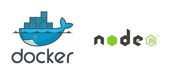
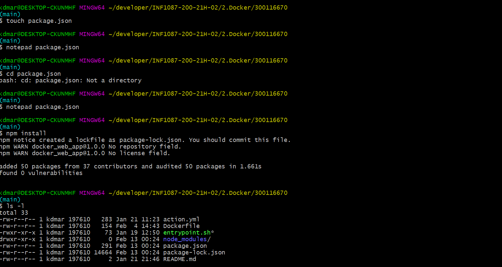

#  Dockerizing a Node.js web app :whale: :computer:

 

Le but de cet exemple est de vous montrer comment obtenir une application Node.js dans un conteneur Docker. Le guide est destiné au développement et non au déploiement en production. Le guide suppose également que vous avez une installation Docker fonctionnelle et une compréhension de base de la structure d’une application Node.js.

## :pushpin: SOMMAIRE :pushpin:

:one: Creer un fichier Node.js app

:two: Creer un dockerfile

:three: Creer le fichier .dockerignore 

:four: Construire l'image

:five: Executer l'image

:six: Test

-----------------------------------------------------------------------------

### :one: Creer l'app Node.js 

Tout d’abord, créer un nouveau répertoire où tous les fichiers resideront. Dans ce répertoire, créez un fichier package.json qui décrit votre application et ses dépendances :

    {
      "name": "docker_web_app",
      "version": "1.0.0",
      "description": "Node.js on Docker",
      "author": "First Last <first.last@example.com>",
      "main": "server.js",
      "scripts": {
        "start": "node server.js"
      },
      "dependencies": {
        "express": "^4.16.1"
      }
    }
 
 
Avec votre nouveau fichier package.json, exécutez npm install. Si vous utilisez npm version 5 ou ultérieure, cela générera un fichier package-lock.json qui sera copié sur votre image Docker.

 

**Ensuite, créez un fichier server.js qui définit une application web en utilisant le framework Express.js :**

    'use strict';

    const express = require('express');

    // Constants
    const PORT = 8080;
    const HOST = '0.0.0.0';

    // App
    const app = express();
    app.get('/', (req, res) => {
      res.send('Hello World');
    });

    app.listen(PORT, HOST);
    console.log(`Running on http://${HOST}:${PORT}`);
    
Dans les prochaines étapes, nous verrons comment vous pouvez exécuter cette application dans un conteneur Docker en utilisant l’image officielle de Docker. Tout d’abord, vous devrez créer une image Docker de votre application.

-----------------------------------------------------------------------------

### :two: Creating a Dockerfile

Créer un fichier vide appelé Dockerfile :

    touch Dockerfile
    
    
    
Ouvrez le Dockerfile dans votre éditeur de texte préféré, dans notre cas ce sera notepad

     $ notepad Dockerfile
     
     

La première chose que nous devons faire est de définir à partir de quelle image nous voulons construire. Nous utiliserons ici la dernière version LTS (support à long terme) du nœud disponible sur le Docker Hub :

     FROM node:10
     
     

Ensuite, nous créons un répertoire pour contenir le code de l’application à l’intérieur de l’image, ce sera le répertoire de travail pour votre application :

     #Create app directory
     WORKDIR /usr/src/app
    
    
    
 Cette image est livrée avec Node.js et NPM déjà installés donc la prochaine chose que nous devons faire est d’installer vos dépendances app en utilisant le binaire npm:
 
 (:warning: *Veuillez noter que si vous utilisez npm version 4 ou une version antérieure, un fichier package-lock.json ne sera pas généré.*)

    # Install app dependencies
    # A wildcard is used to ensure both package.json AND package-lock.json are copied
    # where available (npm@5+)
    COPY package*.json ./

    RUN npm install
    # If you are building your code for production
    # RUN npm ci --only=production
    
    
    
    
    
:warning: *Notez que, plutôt que de copier tout le répertoire de travail, nous ne copions que le fichier package.json. Cela nous permet de profiter des calques Docker mis en cache. bitJudo a une bonne explication de cela ici. En outre, la commande npm ci, spécifiée dans les commentaires, permet de fournir des constructions plus rapides, fiables et reproductibles pour les environnements de production. Vous pouvez lire plus à ce sujet ici.*

Pour regrouper le code source de votre application dans l’image Docker, utilisez l’instruction COPY :

    # Bundle app source
    COPY . .
    
    
    
Votre application se lie au port 8080, vous utiliserez donc l’instruction EXPOSE pour la faire mapper par le démon docker :

    EXPOSE 8080
    
    
    
Enfin, définissez la commande pour exécuter votre application à l’aide de CMD qui définit votre environnement d’exécution. Ici, nous utiliserons node server.js pour démarrer votre serveur :

        CMD [ "node", "server.js" ]
        
        
    
**Votre Dockerfile devrait ressembler à ça en somme:**

    FROM node:10

    # Create app directory
    WORKDIR /usr/src/app

    # Install app dependencies
    # A wildcard is used to ensure both package.json AND package-lock.json are copied
    # where available (npm@5+)
    COPY package*.json ./

    RUN npm install
    # If you are building your code for production
    # RUN npm ci --only=production

    # Bundle app source
    COPY . .

    EXPOSE 8080
    CMD [ "node", "server.js" ]
    
    
 -----------------------------------------------------------------------------

    
    
    
### :three: Creer le .dockerignore file

Créez un fichier . dockerignore dans le même répertoire que votre Dockerfile avec le contenu suivant :

    node_modules
    npm-debug.log
    
**NB**: Dans un projet Git, nous utilisons un fichier .gitignore ; sur Docker il existe le même type de fichier. Celui-ci permet de ne pas copier certains fichiers et/ou dossiers dans notre conteneur lors de l’exécution de l'instruction ADD.

-----------------------------------------------------------------------------

### :four: Creer l'image Docker

Accédez au répertoire contenant votre Dockerfile et exécutez la commande suivante pour construire l’image Docker. Le drapeau -t vous permet de taguer votre image afin qu’elle soit plus facile à trouver plus tard en utilisant la commande docker images :

    docker build -t <your username>/node-web-app .
    
*Your image will now be listed by Docker:*

    $ docker images
    

   **Example
REPOSITORY                      TAG        ID              CREATED**

node                            10         1934b0b038d1    5 days ago
<your username>/node-web-app    latest     d64d3505b0d2    1 minute ago
    
    

-----------------------------------------------------------------------------

    
### :five: Exécuter l'image

L’exécution de votre image avec -d exécute le conteneur en mode détaché, laissant le conteneur tourner en arrière-plan. Le drapeau -p redirige un port public vers un port privé à l’intérieur du conteneur. Exécutez l’image que vous avez précédemment créée :

    docker run -p 49160:8080 -d <your username>/node-web-app
    
    
    
**Print the output of your app:**

    # Get container ID
    $ docker ps

    # Print app output
    $ docker logs <container id>

    # Example
    Running on http://localhost:8080
    
If you need to go inside the container you can use the exec command:

     #Enter the container
     $ docker exec -it <container id> /bin/bash
     
     
     
     
-----------------------------------------------------------------------------

     
    
### :six: Test

Pour tester votre application, obtenez le port de votre application que Docker a cartographié :

      $ docker ps
      

**Example
ID            IMAGE                                COMMAND    ...   PORTS**

ecce33b30ebf  <your username>/node-web-app:latest  npm start  ...   49160->8080
In the example above, Docker mapped the 8080 port inside of the container to the port 49160 on your machine.
       
   Dans l’exemple ci-dessus, Docker a mappé le port 8080 à l’intérieur du conteneur au port 49160 de votre machine.
   
   
Vous pouvez maintenant appeler votre application en utilisant curl (installez si nécessaire via : sudo apt-get install curl) :

       $ curl -i localhost:49160

       HTTP/1.1 200 OK
       X-Powered-By: Express
       Content-Type: text/html; charset=utf-8
       Content-Length: 12
       ETag: W/"c-M6tWOb/Y57lesdjQuHeB1P/qTV0"
       Date: Mon, 13 Nov 2017 20:53:59 GMT
       Connection: keep-alive

       Hello world
       
 ### SOURCE DU TUTORIEL
 :star: Rendez-vous sur:
 
 [:round_pushpin:Nodejs](https://nodejs.org/fr/docs/guides/nodejs-docker-webapp/) !

