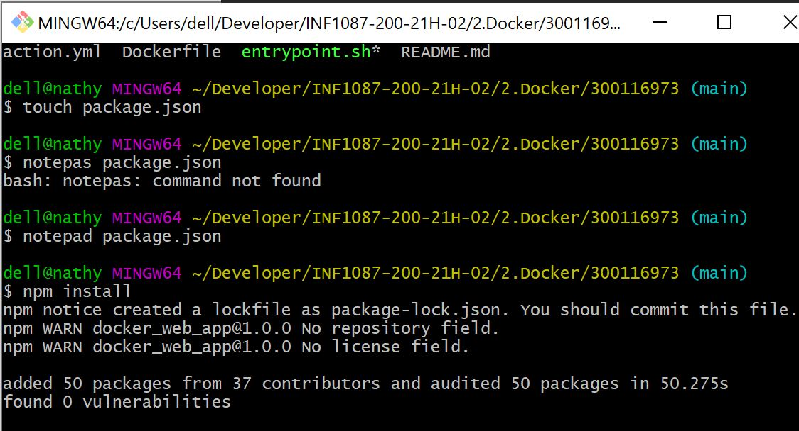
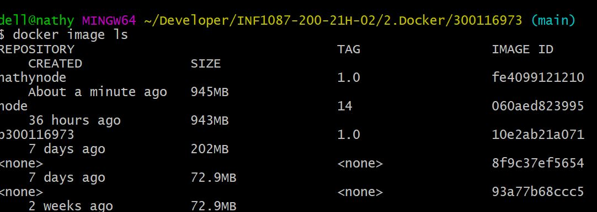
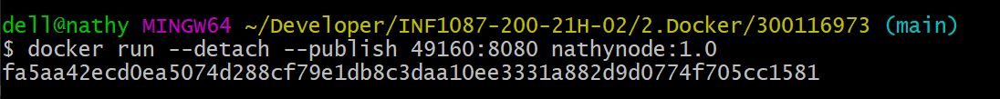
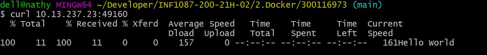

# :apple: Executer une simple application Node.js sur Docker :apple:

:smile: Nous allons vous montrer comment obtenir une application Node.js dans un conteneur Docker.:smile:

## :one:  Creation de l'application Node.js

Pour ce faire nous allons créer un fichier `package.json` qui décrit votre application et ses dépendances :

```
{
  "name": "docker_web_app",
  "version": "1.0.0",
  "description": "Node.js on Docker",
  "author": "First Last <first.last@example.com>",
  "main": "server.js",
  "scripts": {
    "start": "node server.js"
  },
  "dependencies": {
    "express": "^4.16.1"
  }
}
```

## :two: Executer nmp install



Avec votre nouveau fichier package.json, exécutez npm install. Si vous utilisez npm version 5 ou ultérieure, 
cela générera un fichier `package-lock.json` qui sera copié sur votre image Docker.

## :three: Creer un fichier `server.js`

Créez un fichier `server.js` qui doit définir une application web en utilisant le framework `Express.js`

```
'use strict';

const express = require('express');

// Constants
const PORT = 8080;
const HOST = '10.13.237.23';

// App
const app = express();
app.get('/', (req, res) => {
  res.send('Hello World');
});

app.listen(PORT, HOST);
console.log(`Running on http://${HOST}:${PORT}`);
```
La prochaines étapes consiste, a exécuter cette application dans un conteneur Docker en utilisant 
l’image officielle de Docker. Tout d’abord, nous devons créer une image Docker de notre application.

## :four: Creation du `Dockerfile`

creer un fichier `Dockerfile`

`touch dockerfile`

:apple: a l'aide d'un editeur ouvrir votre Dockerfile et mettez les elements suivant :

```
FROM node:14

# Create app directory
WORKDIR /usr/src/app

# Install app dependencies
# A wildcard is used to ensure both package.json AND package-lock.json are copied
# where available (npm@5+)
COPY package*.json ./

RUN npm install
# If you are building your code for production
# RUN npm ci --only=production

# Bundle app source
COPY . .

EXPOSE 8080
CMD [ "node", "server.js" ]

```

## :five: Creation d'un fichier .dockerignore

Creer ce fichier dans le meme repertoire que Dockerfile et mettre les elements suivant a l'interieur: 

```
node_modules
npm-debug.log

```

:apple: Ceci empêchera la copie de vos modules locaux et journaux de débogage sur votre image Docker et éventuellement
l’écrasement des modules installés dans votre image.

## :six: Construire votre image

Acceder a votre repertoire `Dockerfile` et exécutez la commande suivante pour construire l’image Docker. 
Le drapeau `-tag` vous permet de taguer votre image afin qu’elle soit plus facile à trouver plus tard en utilisant la commande docker images :

`docker image build --tag nathynode:1.0 .`


:shark:Vous pouvez verifier votre image avec `docker images ls`



## :seven: Exercuter votre image##



```docker run -detach -publish 49160:8080 nathynode:1.0```

## :eight: Imprimer le resultat de votre application

`docker ps` pour voir votre ID et le port ou est logee votre image et `docker logs fa5aa42ecd0e` pour afficher sur une page web. 'fa5aa42ecd0e' reprensente le ID de mon image.

## :nine:  Publier le port

```curl 10.13.237.23:49160```



References : :link: https://nodejs.org/en/docs/guides/nodejs-docker-webapp/


