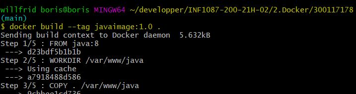
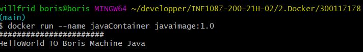

# :rocket: Java Hello World avec Dockerfile
-----------------------------------
## :a: Dockerfile
-------------------------------
  Mon fichier Dockerfile vas me permettre de creer une image contenant notre environnement java pour pouvoir afficher Hello World a la creation du container 
 ### Dockerfile
 ```
FROM java:8
WORKDIR /var/www/java
COPY . /var/www/java
RUN javac HelloWorld.java
CMD ["java","HelloWorld"]

 ```
### :one: FROM java:8
notre image java:8 contient deja tout l'environnement necessaire

### :two: WORKDIR /var/www/java
j'utilise le repertoire **/var/www/java** comme repertoire de travail

### :three: COPY . /var/www/java
je copie mes fichier dans mon repertoire de travail

### :four: RUN javac HelloWorld.java
j'excecute mon script **HelloWorld.java** a la creation/execution de notre container

### :five: CMD ["java","HelloWorld"]
je donne la commande  **java HelloWorld** au demarrage du container


## :b: HelloWorld.java
--------------------------------
mon fichier HelloWorld.java vas executer notre **"Hello World"**

### HelloWorld.java

```
import java.util.Scanner;
 class HelloWorld{

	public static void main(String[] args){
		 Scanner sc = new Scanner(System.in); 
		 System.out.println("#######################");
		 System.out.println("HelloWorld TO Boris Machine Java");


}

}
```
## :notebook: Creer Image et Executer le Container
-------------------------------------------

### Creer Image
```
$ docker build --tag javaimage:1.0 .
```


### Executer/Creer le Container
```
$ docker run --name javaContainer javaimage:1.0 
HelloWorld TO Boris Machine Java
```


#### editer par --- boris kwayep
