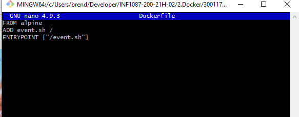
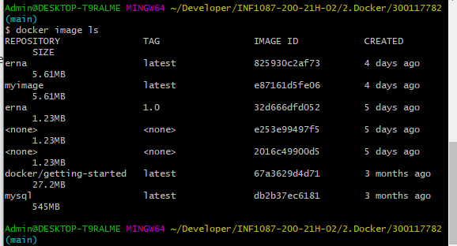
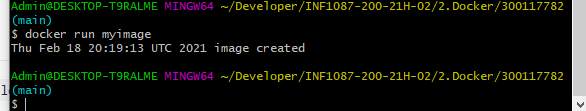

# :round_pushpin: Conception de notre image
-----------------------------------
## :pushpin: Dockerfile
-------------------------------
  Mon fichier Dockerfile vas me permettre de creer une image contenant notre environnement Alpine 
 ### Dockerfile

```

FROM alpine
ADD event.sh /
ENTRYPOINT ["/event.sh"]

```



### :one: Configuration

Pour commencer, créons un script, log-event.sh. Il suffit d'ajouter une ligne à un fichier et de l'imprimer :

```

echo `date` $@ >> log.txt;
cat log.txt;

```

Et maintenant, créons un simple Dockerfile :

```
FROM alpine
ADD log-event.sh /

```

### :two: Exécution de l'image

L'instruction d'exécution s'exécute lorsque nous construisons l'image. Cela signifie que la commande passée à run s'exécute au-dessus de l'image actuelle dans un nouveau calque. Le résultat est ensuite transmis à l'image



```
docker build -t myimage:1.0 .
```

Nous espérons maintenant avoir une image Docker contenant un fichier log.txt avec une ligne de création d'image à l'intérieur. Vérifions cela en lançant un conteneur basé sur l'image :

```
docker run myimage cat log.txt
```



## Reference

:link: https://www.baeldung.com/ops/dockerfile-run-cmd-entrypoint
