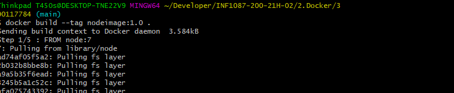
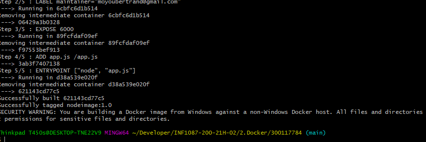
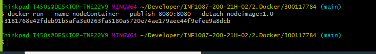
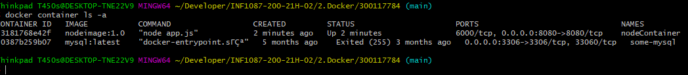

## Laboratoire DockerFile
-------------------------------------
## :one: Conteneuriser le serveur web avec Node 
-------------------------------------
Mon fichier Dockerfile va me servir a creer une image contenant Node,pour a la fin creer un Server Web.

## :two:Dockerfile 
```
FROM node:7
ADD app.js /app.js
ENTRYPOINT ["node", "app.js"]

```
Ce fichier Dockerfile va telecharger notre image node dans DockerHub.Puis nous ajouterons notre fichier app.js a notre image,et en fin nous prendrons comme entee **node app.js**


## :three: Fichier app.js 

```
const http = require('http');
const os = require('os');
console.log("Bertrand server starting...");
var handler = function(request, response) {
console.log("Received request from " + request.connection.remoteAddress);
response.writeHead(200);
response.end("You've hit " + os.hostname() + "\n");
};
var www = http.createServer(handler);
www.listen(8080);

```
Notre script excecutera le server web au **port 8080**

## :four: Creation de l'image

```
$ docker build --tag nodeimage:1.0 .

```

-----------------------------------

## :five: Creer le Containeur 
```
$ docker run --name nodeContainer --publish 8080:8080 --detach nodeimage:1.0 

```

---------------------------------------

## :six: Resources
Pris dans le livre **Kubernetie In action**

## :seven: Test
```
$ curl http://localhost:8080
"You've hit "
```

