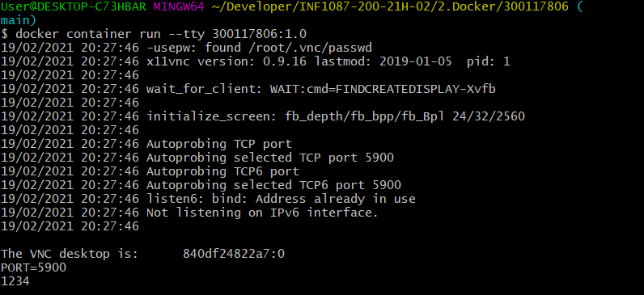
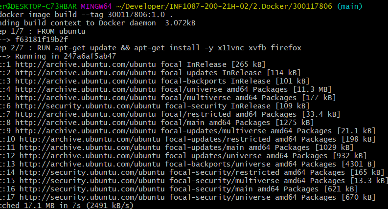
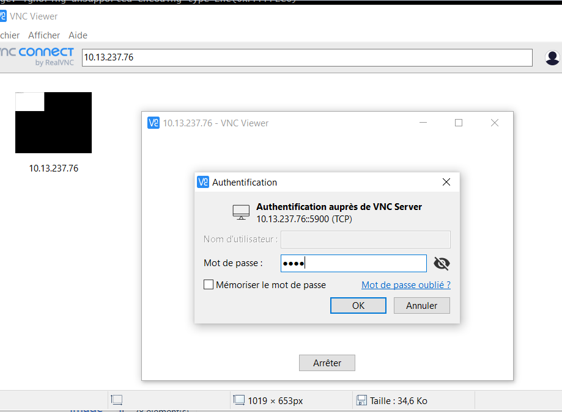
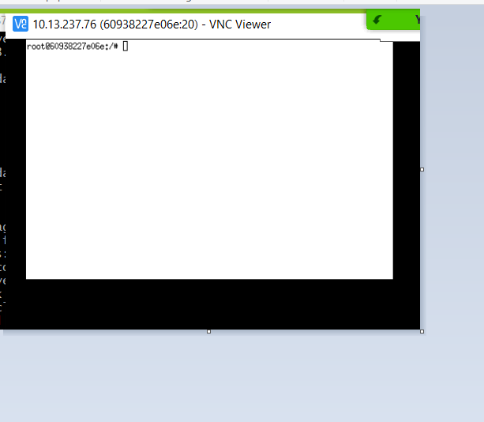

LES ÉTAPES DE CONCEPTION DE L'IMAGE
INTRODUCTION

-Dockerfile est un document texte qui contient toutes les commandes qu'un utilisateur peut appeler sur la ligne de commande.

 Dockerfile

# ----------Tout d'abord---------

```
FROM      ubuntu  
MAINTAINER ######  
LABEL Description="This image is used to start the foobar executable" Vendor="ACME Products" Version="1.0"  
RUN apt-get update && apt-get install -y inotify-tools nginx apache2 openssh-server
```


# -------------- Debut --------------------------------------
FROM ubuntu  
    # Install vnc, xvfb in order to create a 'fake' display and firefox  
    RUN apt-get update && apt-get install -y x11vnc xvfb firefox  
    RUN mkdir ~/.vnc  
    # Setup a password  
    RUN x11vnc -storepasswd 1234 ~/.vnc/passwd  
    # Autostart firefox (might not be the best way, but it does the trick)  
    RUN bash -c 'echo "firefox" >> /.bashrc'  
    EXPOSE 5900 
    
# ----------------- Fin --------------------------------

# OUVERTUR DU PORT INTERNET
EXPOSE 5900

# DEMARRRAGE DU WEB SERVEUR
FROM      ubuntu  
    MAINTAINER ######  
    LABEL Description="This image is used to start the foobar executable" Vendor="ACME Products" Version="1.0"  
    RUN apt-get update && apt-get install -y inotify-tools nginx apache2 openssh-server

# EXPLICATION DOCKERFILE 
** FROM ubuntu

# Image source pour la  création 

---------------------------------------
 docker container run --tty 300117806:1.0

---------------------------------------


---------------------------------
# Démarrer le docker conteneur
docker image build --tag 300117806:1.0 

docker container run --tty 300117806:1.0

The VNC desktop is:      840df24822a7:0
PORT=5900
1234

docker container run --publish 5900:5900 300117806:1.0
----------------------------------------------


# CONSTRUCTION DE L'image
-----------------------------

 docker image build
 docker image build --tag 300117806:1.0 .

# L'EXECUTION DE L'IMAGE 

 docker container run --name 300117806 --tty --publish 5900:5900 300117806:1.0
 
 
 --------------------------------------------------------------
 
# RESULTAT FINAL 🍌








lien: http://www.ageekslab.com/docker/docker3/
