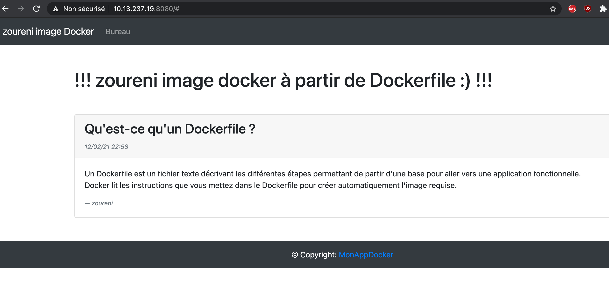

# ÉTAPES DE CONCEPTION DE NOTRE IMAGE

- **SOMMAIRE**

  - CRÉATION DES SOURCES
  
  - EXPLICATION DU DOCKERFILE
  
  - CONSTRUCTION DE L'IMAGE
  
  - EXÉCUTION DE L'IMAGE
  
  - RÉSULTAT FINAL

## :one: CRÉATION DES SOURCES

### :a: Repertoire db : 

- contient un fichier articles.sql, qui renferme toute l'architecture de la base de données.

```
CREATE DATABASE IF NOT EXISTS test CHARACTER SET utf8;
CREATE USER 'test'@'localhost' IDENTIFIED BY 'test';
GRANT ALL PRIVILEGES ON test.* TO 'test'@'localhost';


USE test;`

CREATE TABLE IF NOT EXISTS articles (
    id INT UNSIGNED NOT NULL AUTO_INCREMENT,
    title VARCHAR(100) NOT NULL,
    author VARCHAR(100) NOT NULL,
    date TIMESTAMP NOT NULL DEFAULT CURRENT_TIMESTAMP,
    content TEXT NULL,
    PRIMARY KEY(id)
) ENGINE=InnoDB DEFAULT CHARSET=utf8;


INSERT INTO articles (title, author, content) VALUES
("Qu'est-ce qu'un Dockerfile ?", 'zoureni', " Un Dockerfile est un fichier texte décrivant les différentes étapes permettant de partir d'une base pour aller $
```

### :b:	Repertoire app : 

- comporte les sources php de notre l'application web.

  - [ ] db-config.php

```
<?php
const DB_DSN = 'mysql:host=localhost;dbname=test';
const DB_USER = "test";
const DB_PASS = "test";
$options = array(
    PDO::MYSQL_ATTR_INIT_COMMAND => "SET NAMES utf8", // encodage utf-8
    PDO::ATTR_ERRMODE => PDO::ERRMODE_EXCEPTION, // gérer les erreurs en tant qu'exception
    PDO::ATTR_EMULATE_PREPARES => false // faire des vrais requêtes préparées et non une émulation
);

```
  - [ ] index.php

```
<?php
ini_set('display_errors', 1);
ini_set('display_startup_errors', 1);
error_reporting(E_ALL);

require 'db-config.php';


function getArticles(PDO $PDO){
    $sql = "SELECT * FROM articles";
    $result = $PDO->query($sql);

    $articles = $result->fetchAll(PDO::FETCH_ASSOC);

    $result->closeCursor();

    return $articles;
}
?>

<!doctype html>
<html lang="fr">
  <head>
    <meta charset="utf-8">
    <meta name="viewport" content="width=device-width, initial-scale=1, shrink-to-fit=no">

    <title>zoureni image Docker !</title>

    <link rel="stylesheet" href="https://maxcdn.bootstrapcdn.com/bootstrap/4.0.0/css/bootstrap.min.css" integrity="sha384-Gn5384xqQ1aoWXA+058RXPxPg6fy4IWvTNh$

    <!-- Bootstrap core CSS -->
    <link href="../../dist/css/bootstrap.min.css" rel="stylesheet">

    <!-- Custom styles for this template -->
    <link href="navbar-top-fixed.css" rel="stylesheet">
  </head>

  <body>
  
      <nav class="navbar navbar-expand-md navbar-dark bg-dark mb-4">
      <a class="navbar-brand" href="#">zoureni image Docker</a>
      <button class="navbar-toggler" type="button" data-toggle="collapse" data-target="#navbarCollapse" aria-controls="navbarCollapse" aria-expanded="false" $
        <span class="navbar-toggler-icon"></span>
      </button>
      <div class="collapse navbar-collapse" id="navbarCollapse">
        <ul class="navbar-nav mr-auto">
            <li class="nav-item">
            <a class="nav-link" href="#">Bureau</a>
          </li>

        </ul>
      </div>
    </nav>

    <main role="main" class="container">

    <h1 class="mt-5">!!! zoureni image docker à partir de Dockerfile :) !!!</h1>

    <?php

try {
            $PDO = new PDO(DB_DSN, DB_USER, DB_PASS, $options);
            $articles = getArticles($PDO);
            foreach ($articles as $article) {
                $articleTime = date("d/m/y H:i", strtotime($article["date"]));
            ?>
                <div class="card mt-5">
                <div class="card-header">
                    <h2 class="h3"><?= $article["title"] ?> <small class="text-muted font-italic"></h2>
                    <?= $articleTime ?></small>
                </div>
                <div class="card-body">
                    <p class="card-text"><?= $article["content"] ?></p>
                    <footer class="blockquote-footer"><cite title="Source Title"><?= $article["author"] ?><cite></footer>
                </div>
                </div>
    <?php
        }} catch (PDOException $pe) {
            echo 'ERREUR :', $pe->getMessage();
        }
    ?>

    </main>

    <footer class="page-footer font-small bg-dark mt-5">
        <div class="footer-copyright text-center py-3 text-white">© Copyright:
            <a href="#"> MonAppDocker</a>
        </div>
    </footer>

  </body>
</html>

```

:pushpin: architecture de mon repertoire actuel

```
├── images
├── app
│   ├── db-config.php
│   └── index.php
├── db
│   └── articles.sql
└── Dockerfile
```

### :ab: DOCKERFILE


```
# --------------- DÉBUT COUCHE OS -------------------
FROM debian:stable-slim
# --------------- FIN COUCHE OS ---------------------


# MÉTADONNÉES DE L'IMAGE
LABEL version="1.0"
MAINTAINER Zoureni


# VARIABLES TEMPORAIRES
ARG APT_FLAGS="-q -y"
ARG DOCUMENTROOT="/var/www/html"


# --------------- DÉBUT COUCHE APACHE ---------------
RUN apt-get update -y && \
    apt-get install ${APT_FLAGS} apache2
# --------------- FIN COUCHE APACHE -----------------


# --------------- DÉBUT COUCHE MYSQL ----------------
RUN apt-get install ${APT_FLAGS} mariadb-server

COPY db/articles.sql /
# --------------- FIN COUCHE MYSQL ------------------


# --------------- DÉBUT COUCHE PHP ------------------
RUN apt-get install ${APT_FLAGS} \
    php-mysql \
    php && \
    rm -f ${DOCUMENTROOT}/index.html && \
    apt-get autoclean -y

COPY app ${DOCUMENTROOT}
# --------------- FIN COUCHE PHP --------------------

# OUVERTURE DU PORT HTTP
EXPOSE 80


# RÉPERTOIRE DE TRAVAIL
WORKDIR  ${DOCUMENTROOT}


# DÉMARRAGE DES SERVICES LORS DE L'EXÉCUTION DE L'IMAGE
ENTRYPOINT service mysql start && mysql < /articles.sql && apache2ctl -D FOREGROUND

```

## :two: EXPLICATION DU DOCKERFILE :mega:

**`FROM debian:stable-slim`**
> Image de base pour créer ma couche OS debian :stable-slim

```
LABEL version="1.0"
MAINTAINER Zoureni
```
> Rajouter de l’information qu’on pourra lire plus tard avec la commande **`docker inspect < nom_de_image >`** et **`docker history <nom_de_image>`**

```
ARG APT_FLAGS="-q -y"

ARG DOCUMENTROOT="/var/www/html"
```
> L’instruction **ARG** permet ici de créer des variables temporaires

```
**RUN apt-get update -y && \

apt-get install ${APT_FLAGS} apache2
```
> Récupération des paquets puis installation d’Apache

```
RUN apt-get install ${APT_FLAGS} mariadb-server
COPY db/articles.sql /
```
> Téléchargement du service MySQL puis rajout du fichier *articles.sql* pour le nouveau conteneur

```
RUN apt-get install ${APT_FLAGS} \
    php-mysql \
    php && \
    rm -f ${DOCUMENTROOT}/index.html && \
    apt-get autoclean -y

COPY app ${DOCUMENTROOT}
```
> Installation de l’interpréteur php et du module php-mysql.

```
EXPOSE 80
```
> Ouverture du port http

```
WORKDIR  /var/www/html
```
> Détermination de */var/www/html* en tant que répertoire de travail afin qu’on soit directement sur ce dossier lorsque le conteneur démarre

```
ENTRYPOINT service mysql start && mysql < /articles.sql && apache2ctl -D FOREGROUND
```
> Démarrage du service MySQL et construction de l'architecture de la base de données grâce au fichier *articles.sql*
> Pour que le conteneur soit toujours en état de running on laisse un processus en premier plan, d'où le lancement du service Apache en premier plan à l'aide de la commande apache2 -D FOREGROUND.

## :three: CONSTRUCTION DE L'IMAGE 

```
docker image build --tag zoureni:1.0 . 
```
> zoureni = nom de l'image

## :four: EXÉCUTION DE L'IMAGE 

```
docker run --detach --name site --publish 8080:80 zoureni:1.0
```

## :five: RÉSULTAT FINAL 




# Reference

https://devopssec.fr/article/creer-ses-propres-images-docker-dockerfile


