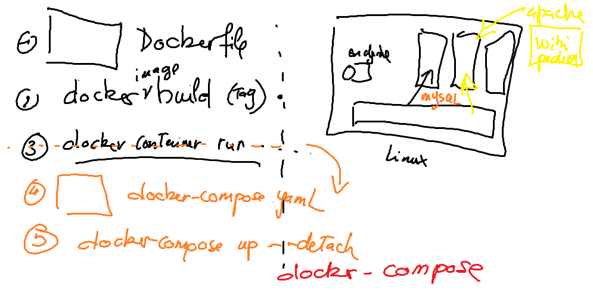

# :two: Compose

#### [:tada: Participation](.scripts/Participation.md)


## :gear: VM

- [ ] Se connecter à [Azure](https://github.com/CollegeBoreal/Tutoriels/tree/main/2.MicroServices/4.Cloud/2.Public/2.Azure)

- [ ] Créer les scripts 'terraform' en utilisant [boot](boot)

* crée un répertoire avec ton :id:

```
mkdir <ton ID>
```

* copie le répertoire `boot` dans ton répertoire :id:

```
cp -r boot <ton ID>
```

* aller dans son répertoire

```
cd <ton ID>
```

* éditer le code source `terraform` avec Visual Studio Code 

```
code .
```

* dans `main.tf` changer tous les noms comportants CB-AZ-300000000 avec CB-AZ-:id: 

- [ ] Créer sa machine virtuelle

* initialiser les modules et fournisseurs

```
terraform init
```

* créer la machine virtuelle

```
terraform apply
```

## :a: Docker Context

https://blog.mikesir87.io/2019/08/using-ssh-connections-in-docker-contexts/

- [ ] Set the `SSH` agent and key 

- [ ] Create the context

```
docker context create machine-CB-AZ-<ton ID> --docker "host=ssh://terraform@<ton IP>"
```

- [ ] Use the context 

```
docker context use machine-CB-AZ-<ton ID>
```

## :b: docker-compose

https://livebook.manning.com/book/docker-in-action-second-edition/chapter-11/81

- [ ] Créer votre répertoire avec votre **c**:id:

    Il faut placer le charactère **c** devant votre :id:

- [ ] Chercher un fichier `docker-compose.yml` pour illustrer plusieurs containeurs sur un seul `noeud`.


Penser à `wordpress`, bien sûr vous pouvez utiliser cet example

https://docs.docker.com/samples/wordpress/

ou chercher avec Google en tapant dans la recherche

```
docker-compose yml example bitnami
```

:bulb: Le faire sur votre machine Linux

SVP Faites un README.md avec de belles images montrant que vous avez éxécuté votre devoir

Bonne chance



