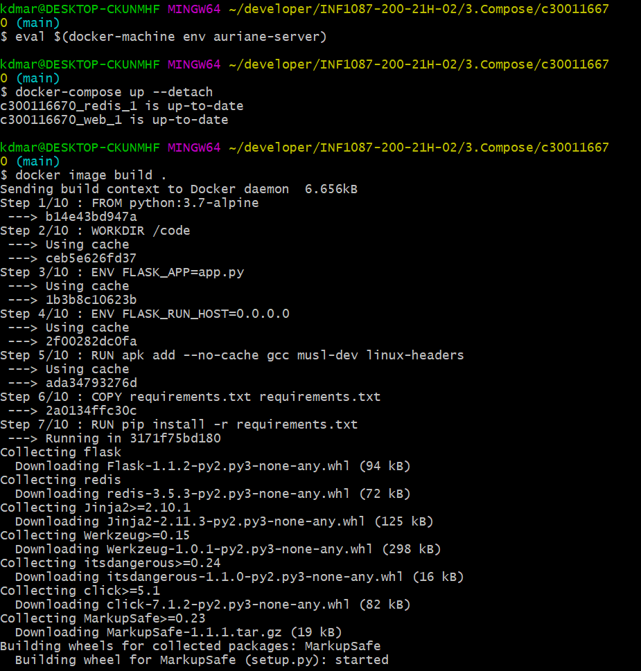
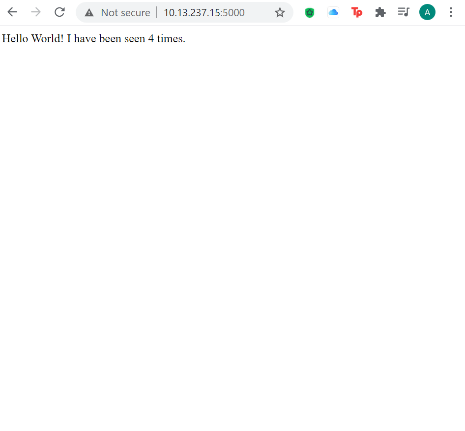

# Python web application 🐍🐳

Sur ce Lab, nous allons créer une application Web Python simple exécutée sur Docker Compose. L'application utilise le framework Flask et gère un compteur d'accès dans Redis. Bien que l'exemple utilise Python, les concepts présentés ici devraient être compréhensibles même si vous ne le connaissez pas.

## :a: EXECUTION

## :b: RESULTAT

[votre_adresse_ip]:5000 qui est notre port désigné dans notre fichier docker-compose.yaml

Dans mon cas j'écrirais 10.13.237.15:5000

**SOURCE DU TUTORIEL**

📌 https://docs.docker.com/compose/gettingstarted/

**AMELIORER VOTRE APPLICATION WEB**
 
📌https://www.digitalocean.com/community/tutorials/how-to-make-a-web-application-using-flask-in-python-3-fr
