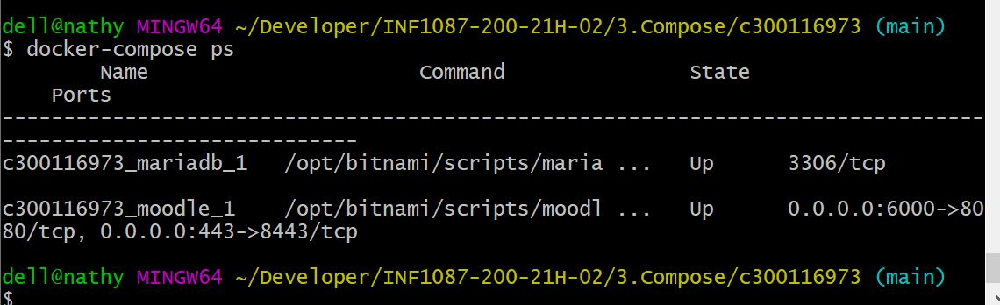
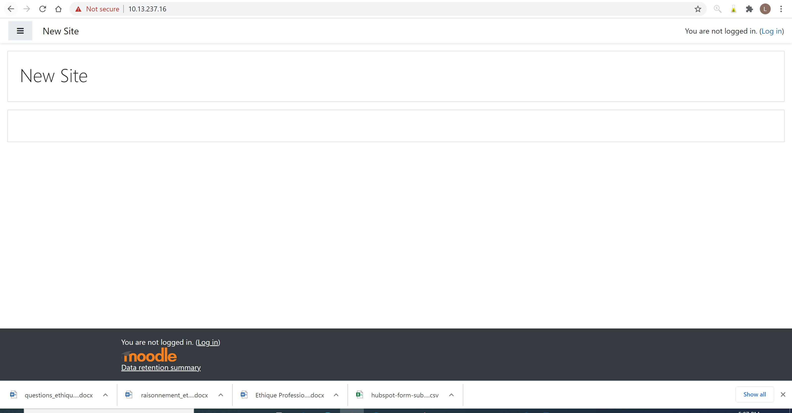
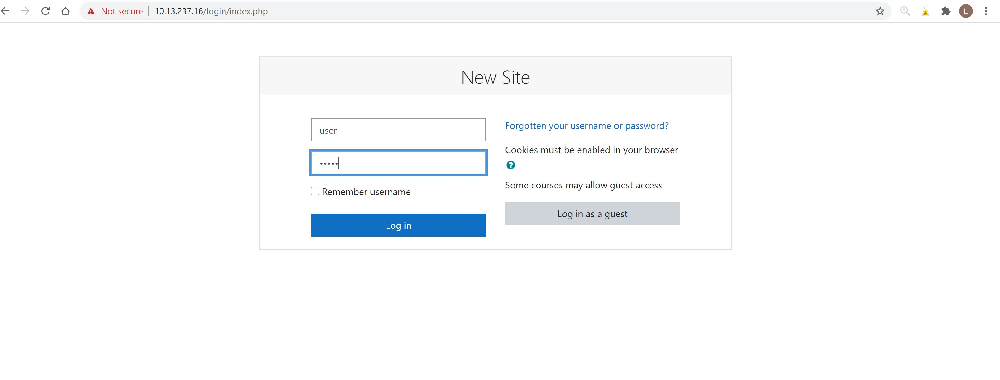
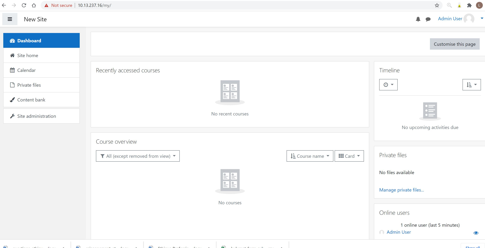

# Installer Moodle avec Docker-compose.yml

pour installer Moodle vous devez creer un run docker file avec le format .yml. 


```
version: '2'
services:
  mariadb:
    image: 'docker.io/bitnami/mariadb:10.5-debian-10'
    environment:
      - ALLOW_EMPTY_PASSWORD=yes
      - MARIADB_USER=bn_moodle
      - MARIADB_DATABASE=bitnami_moodle
      - MARIADB_CHARACTER_SET=utf8mb4
      - MARIADB_COLLATE=utf8mb4_unicode_ci
    volumes:
      - 'mariadb_data:/bitnami/mariadb'
  moodle:
    image: 'docker.io/bitnami/moodle:3-debian-10'
    ports:
      - '6000:8080'
      - '443:8443'
    environment:
      - MOODLE_DATABASE_HOST=mariadb
      - MOODLE_DATABASE_PORT_NUMBER=3306
      - MOODLE_DATABASE_USER=bn_moodle
      - MOODLE_DATABASE_NAME=bitnami_moodle
      - ALLOW_EMPTY_PASSWORD=yes
      - MOODLE_USERNAME=user
      - MOODLE_PASSWORD=bitnami
    volumes:
      - 'moodle_data:/bitnami/moodle'  
      - 'moodledata_data:/bitnami/moodledata'
    depends_on:
      - mariadb
volumes:
  mariadb_data:
    driver: local
  moodle_data:
    driver: local
  moodledata_data:
    driver: local

```

Vous devez l'executer avec la commande suivante

``` 
docker-compose up --detach

puis

docker-compose ps

```



Une fois fois que vos container sont Up vous pouvez allez tester dans le navigateur web avec avotre adresse ip suivie du port que vous avez utilise

```
https://10.13.237.16:443
```



Mooddle doit s'ouvrir alors cliquez sur login et entre le user name qui est `use` et le mot de passe qui est `bitnami`




Vous avez reussir a vous connecter a moodle alors vous pouvez commencer vos configurations.



References : https://devopsheaven.com/moodle/devops/deploy/docker/docker-compose/2017/09/08/deploy-moodle-remote-server-docker.html
