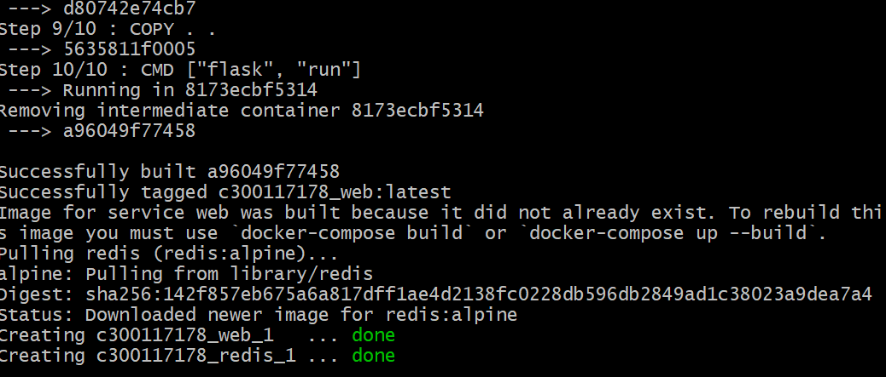
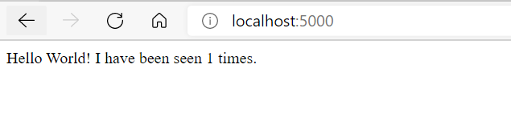

# :rocket:Application web avec Docker Compose
## what we have
1. requirement.txt **python dependencies** 
2. Dockerfile **Image pour environnement python**
3. Docker compose **Contenant 2 container**

```
version: "3.9"
services:
  web:
    build: .
    ports:
      - "5000:5000"
  redis:
    image: "redis:alpine"
```

:one: **build .** execute le Dockerfile se trouvant sur le repertoire courrant

:two: **ports** indique le port de notre container

-----------------------------------

# run the appliction
docker-compose up --detach



# Test the application
http://localhost:5000/



### source :📌 https://docs.docker.com/compose/gettingstarted/
