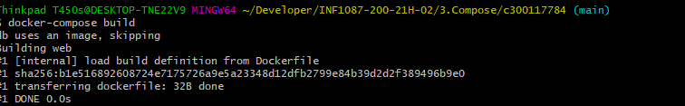
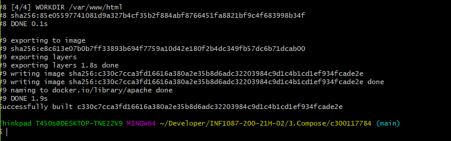
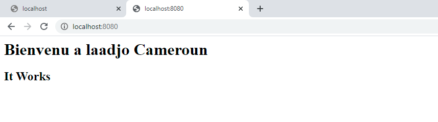

# :rainbow: CREAATION APACHE WEB SERVER AVEC DOCKER

## On utilisera un fichier Dockerfile et un Fichier HTML pour la creation de notre Container Apache Server 

---------------------------
## :one: Creation des images pour le fonctionnement de nos containers 
```
$ docker-compose build
```
---

---


## :two: Creation des containers 

```
$ docker-compose up -detach
```


---


## :three: TEST de l'application 

Cela consiste a le lancer sur le navigateur en saisant 

```
localhost:8080 
```


# :rainbow:                      FIN                :rainbow:
