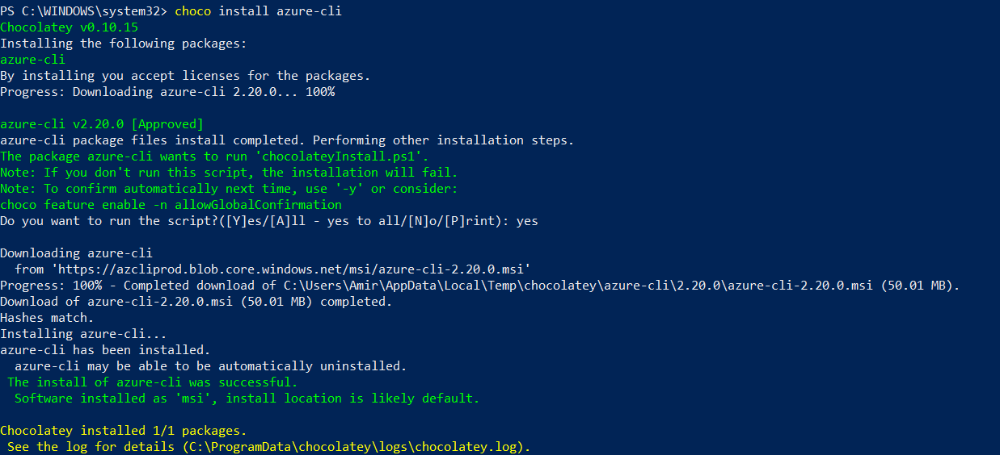
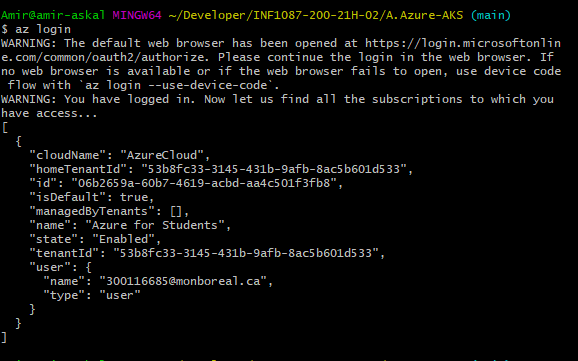
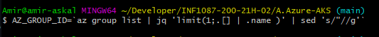
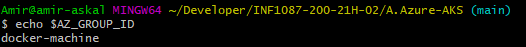
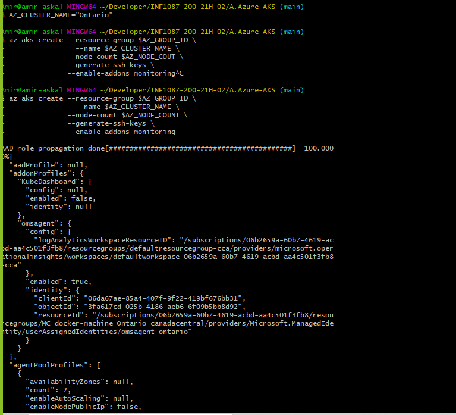
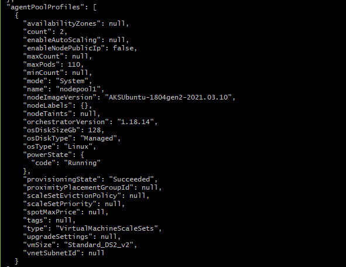
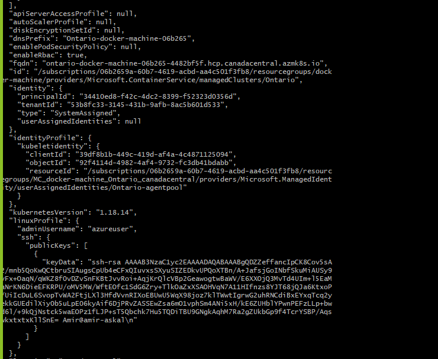
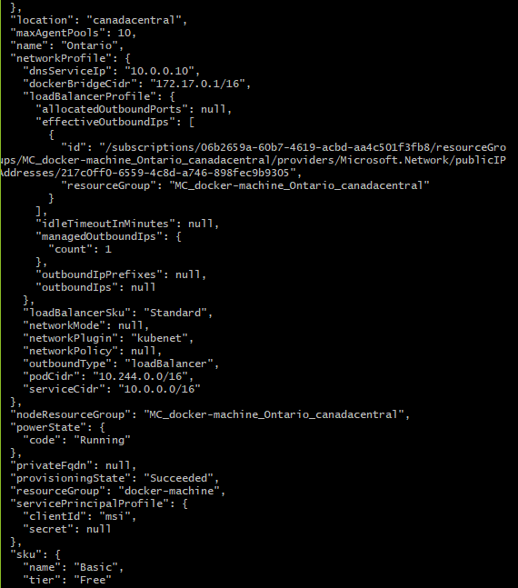
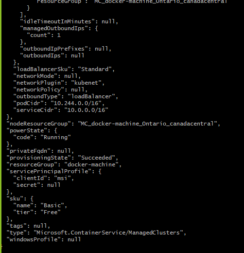
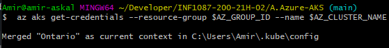

# 📚 Installation Azure dans votre Ordinateur 

⏰ Utilisant powershell 
---------------------

🛶 Pour ouvrir une session a Azure 
-----------------------------

🐿️ se connecter azure 
----------------------

㊙️ creer la grappe (cluster)
--------------------
🃏 Mettre son groupe dans une variable d'environnement

🃏 verifiez si des groupes existent 
----------------------------------

🃏 creer sa grappe 
------------------
      
 
🃏 Ajouter votre grappe kubia à votre contexte Kubernetes
---------------------------------------------------------

🃏 Lens
-----------

