# Installer Wordpress a partir d'Azure kubernetes services et joindre la page workpress a son nom de domaine

:heavy_check_mark: Au prealable vous devez installer `Kubectl` et `lens` sur votre ordinateur,  s'enregistrer a azure et creer ces clusters avec le context kubernetes  (Azure Kubernetes services). Pour notre cas nous avons creer deux marchines virtuelles  cluster. Une fois fait ouvrez votre cluster avec lens prealablement installer dans votre ordinateur.

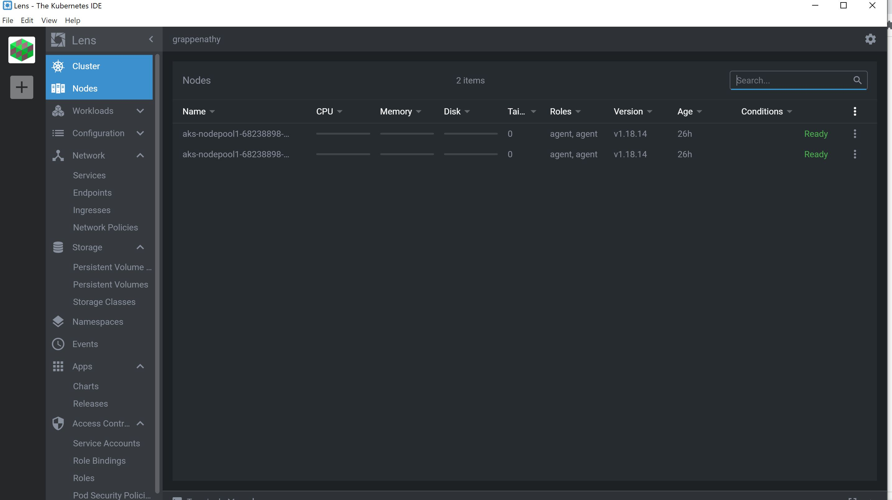

:heavy_check_mark: Dans l'application Lens, allez a apps et choisir Charts une fenetre doit s'ouvrir pour vous permettre d'ecrire le nom de l'application que vous aimeriez installer. Dans notre cas nous avons choisir d'installer Wordpress.

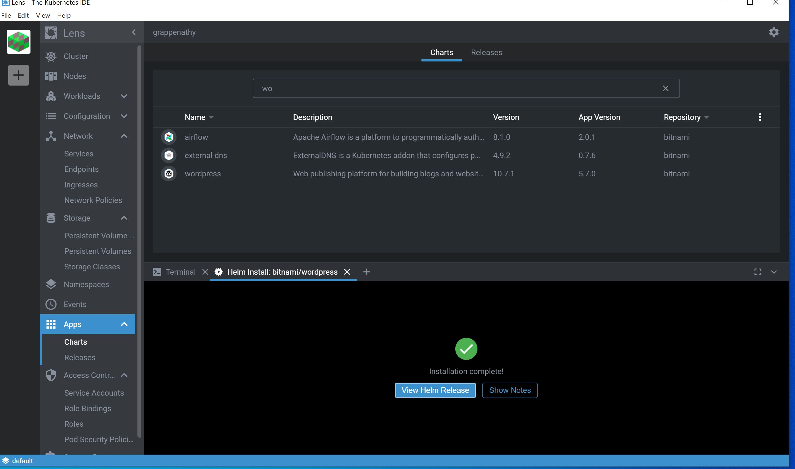

:heavy_check_mark: Lorsque vous choissisez l'application que vous aimeriez installer cette fennetre s'affiche :

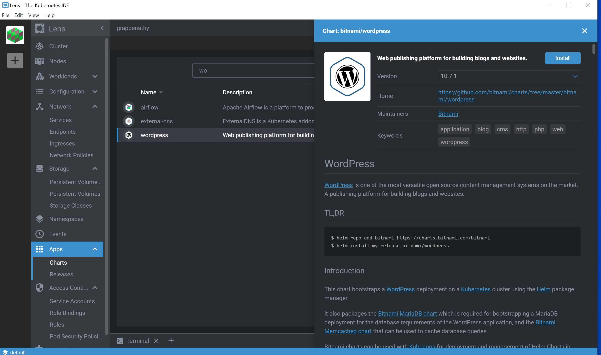

:heavy_check_mark: cliquez sur install pour installer l'application :
cette fenetre s'affiche cliquez sur install

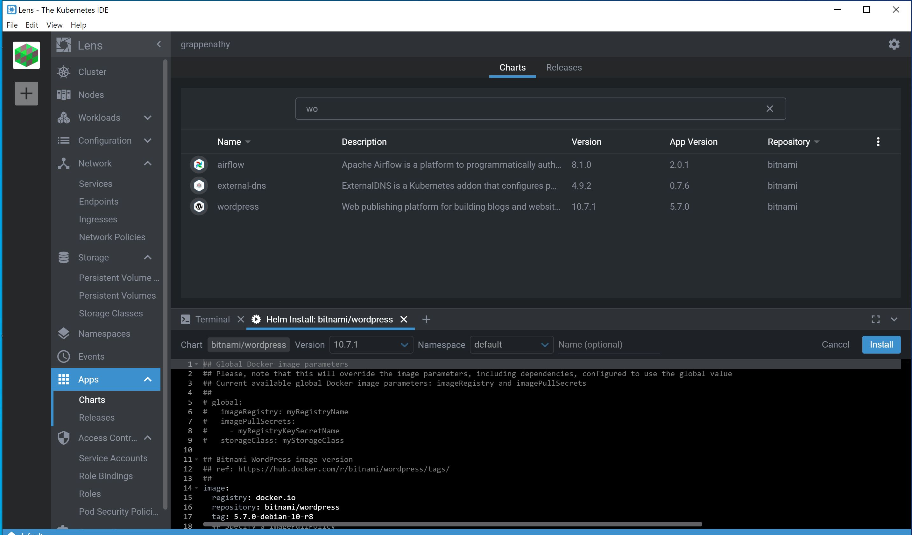

:heavy_check_mark: Ensuite allez de nouveau a apps et releases pour voir l'application que vous avez installee. le status doit etre deployed.

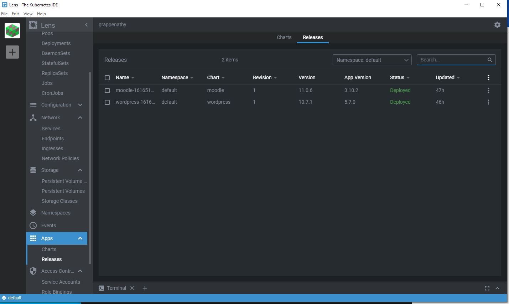

:heavy_check_mark: Double cliquez sur l'application que vous avez installer; cette fenetre doit s'ouvrir:

:heavy_check_mark: Puis celle ci s'affiche, copiez la commande qui vous permettra de generer votre mot de passe

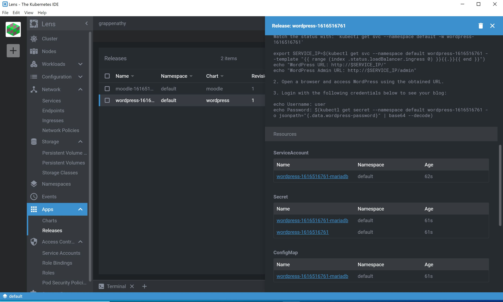

:heavy_check_mark: Allez dans git bash et tapez cette la commande d'echo password. Cela va generer automatiquement votre mot de passe que vous allez utiliser.

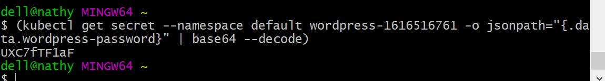

:heavy_check_mark: cliquez sur network,puis service dans lens afin de voir l'adresse ip publique qui vous permettra de consulter wordpress que vous avez installer, ensuite allez dans votre navigateur tapez cet address suivie de admin cette page va s'ouvrir pour vous permettre de d'entre votre credential:

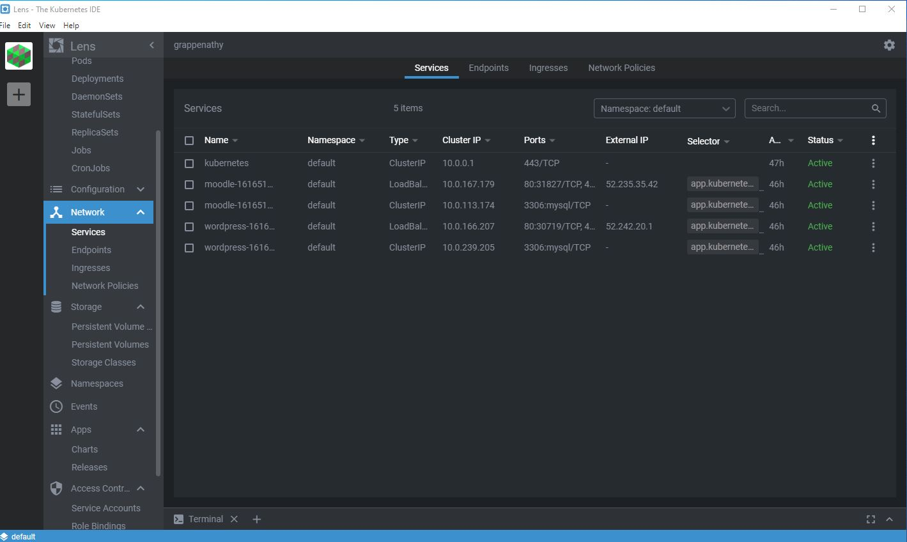

:heavy_check_mark:Taper votre adresse ip publique que lens vous a donnee et tapez le sur le navigateur cette page va s'afficher.

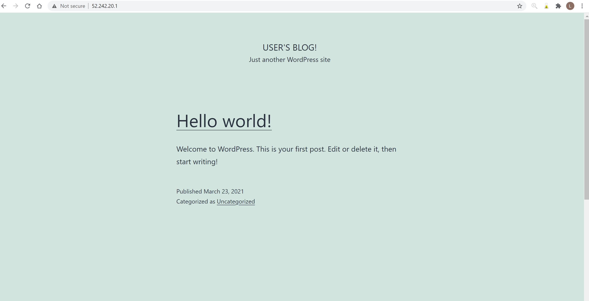

:heavy_check_mark: Copier les informations qui vont vous permettre d'obtenir votre mot de passe pour vous connecter en tant que qu'administrateur a votre addresse ip ajouter / administrator, cette page va s'ouvrir, entre vos credentials.

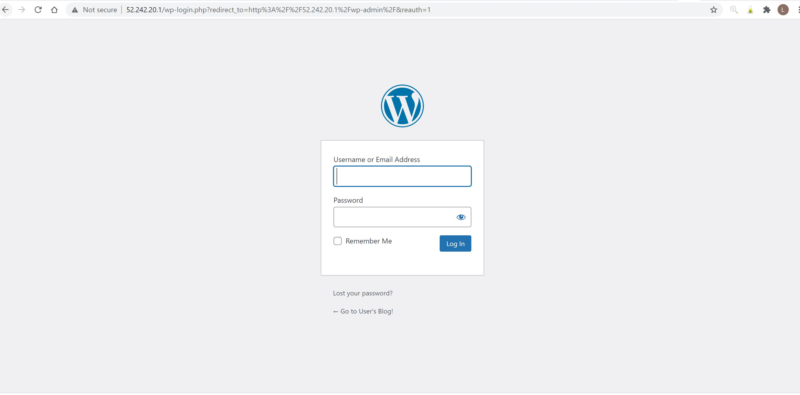
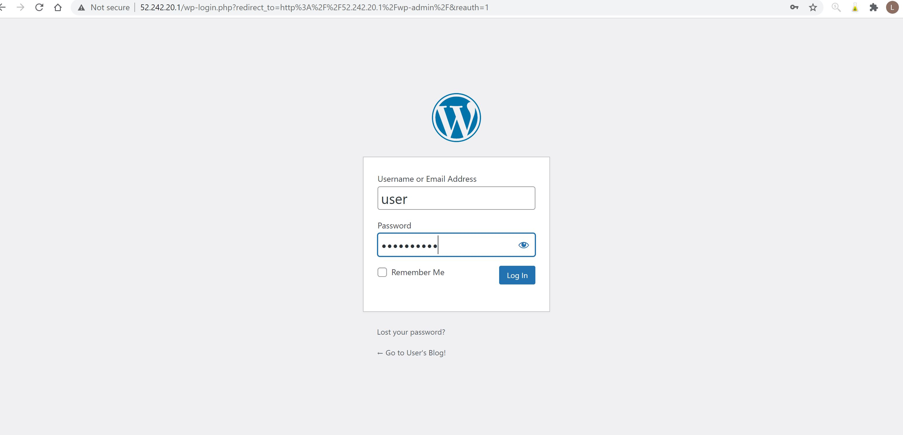

:heavy_check_mark: Voila vous avez reussir a installer wordpress a partir de lens :smile:

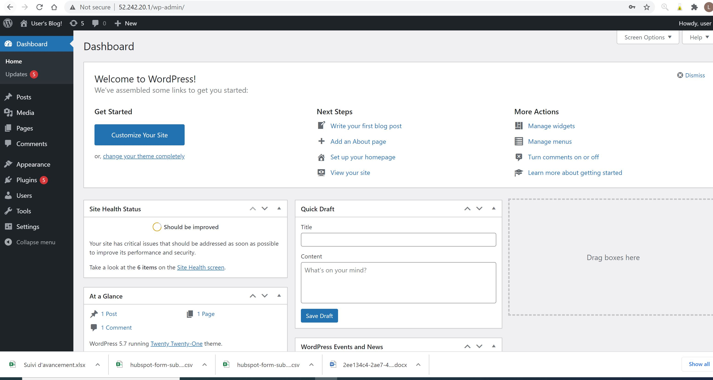

✔️ Allez dans votre portail azure dans Zone DNS pour ajouter un jeu d'enregistrement aks a votre nom de domaine et ajouter votre adresse ip externe donne par lens. Pour notre cas notre adresse externe wordpress est `52.242.21.1` et notre nom de domaine est `2splus.live`

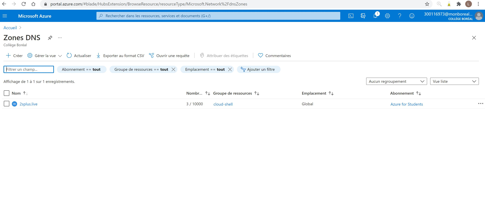

👖 cliquez sur votre DNS `2splus.live` et ajouter un jeux d'enregistrement `aks` et l'adresse ip externe.

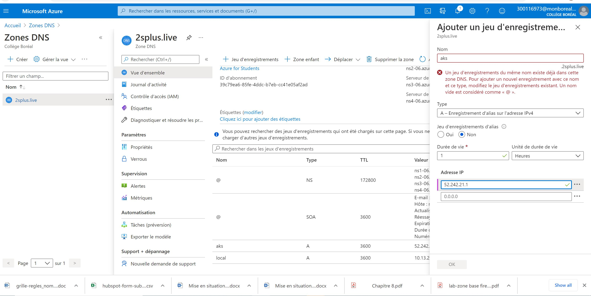

☑️ Une fois cela fait sa se presente comme l'image suivante

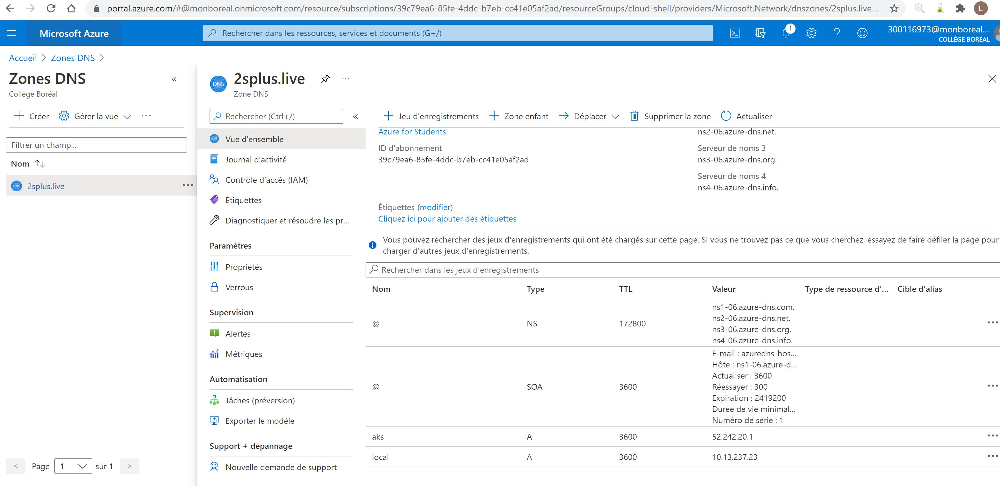

✔️ Apres avoir ajouter notre adresse ip externe de wordpress dans notre zone DNS Azure, nous devons etre capable d'ouvrir wordpress avec notre domaine `aks.2splus.live`

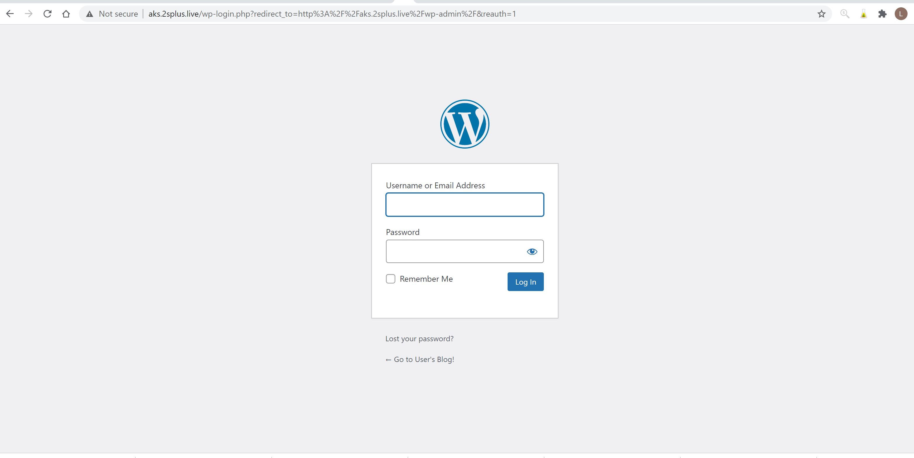

👣 Ouf nous avons pu joindre notre nom de domaine a notre adresse ip publique wordpress.

