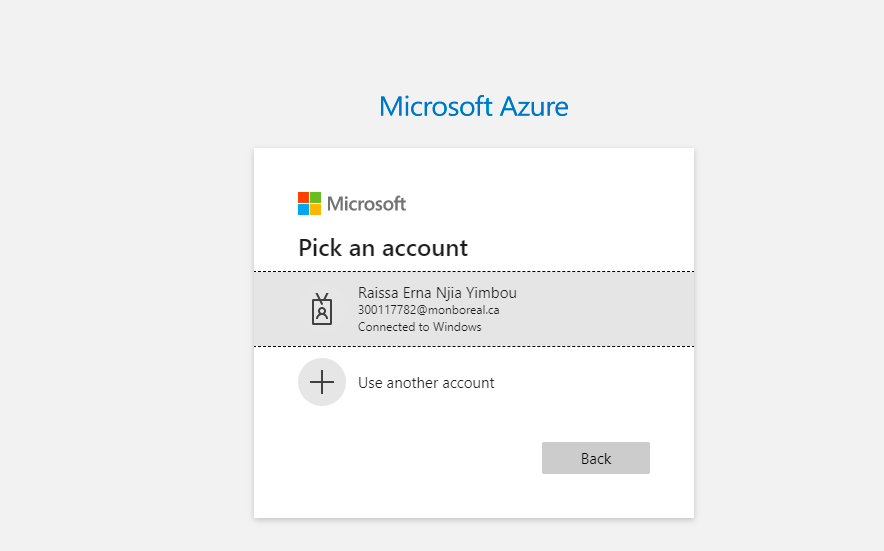
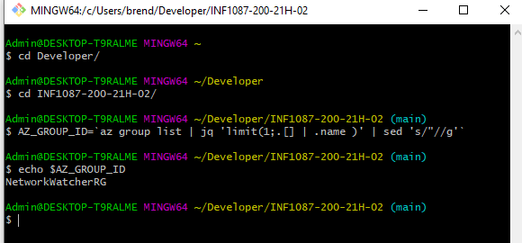
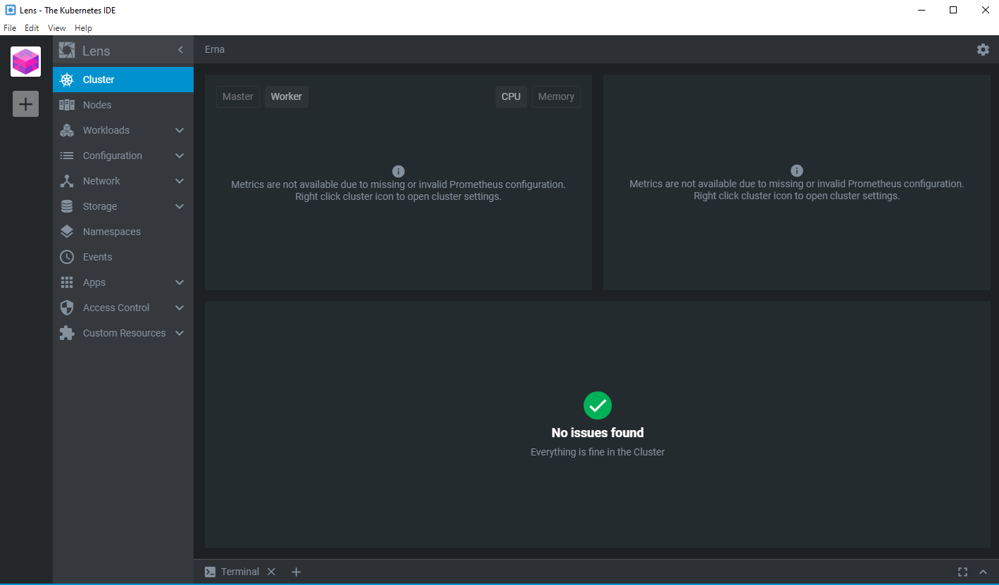
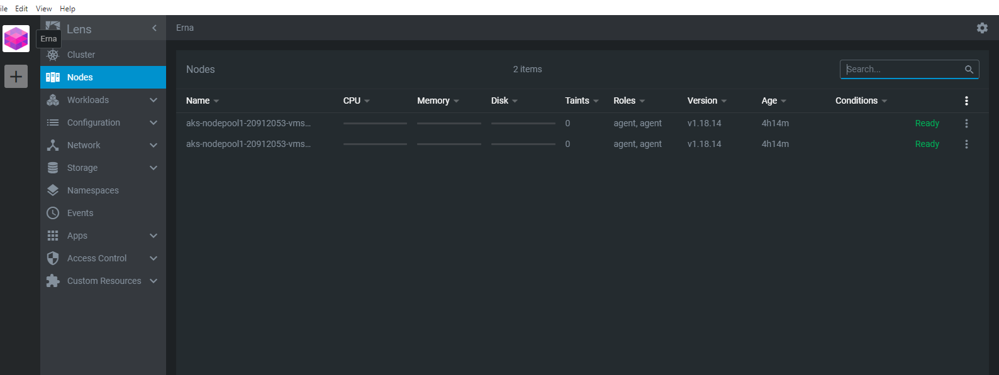
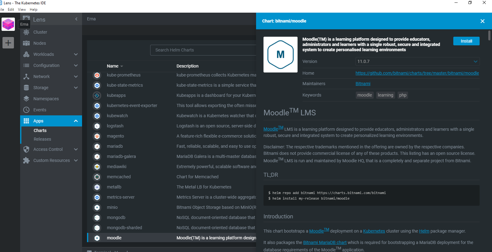
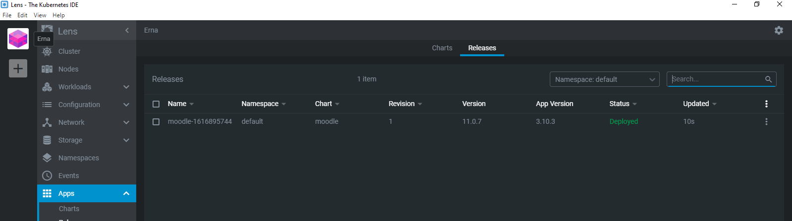
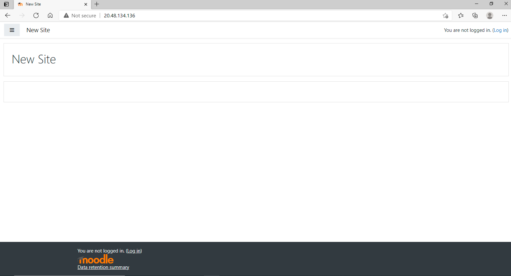
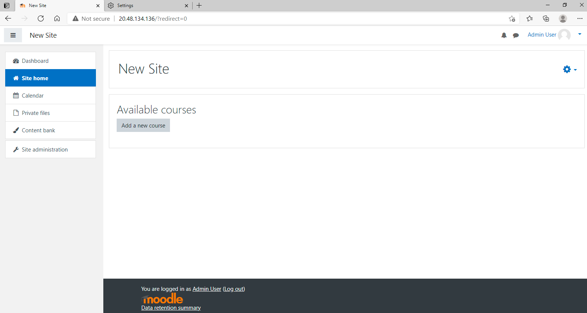
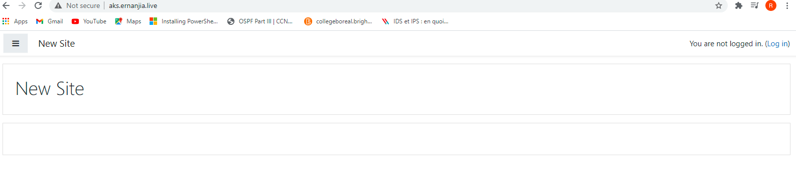

# :monkey::palm_tree::tiger2: - Installer de `Moodle` avec kubernetes services et apartie de Lens Installer `pplication Moodle`

#
## :pig2: se connecter à Azure en utilisant les commandes CLI 

## :rooster: Créer sa grappe et Vérifier que le groupe existe

 

# :cat2::ant: Utiliser Lens pour installer application Moodle

## :camel: Lancer Lens et verifier notre grappe `Erna`

## :poodle: Instalation de Moodle

## :elephant: Vérifier si Moodle existe 

## :leopard: utiliser le nom d'utilisateur `user` et le mots de passe recu

## :octopus:

## :mouse2:  ajouter l'adresse ip externe de Moodle dans la zone DNS Azure, pour pouvoire etre se connecter a Moodle avec le nom de domaine `ernanjia.live`

## :dancer: :tada: ça marche
