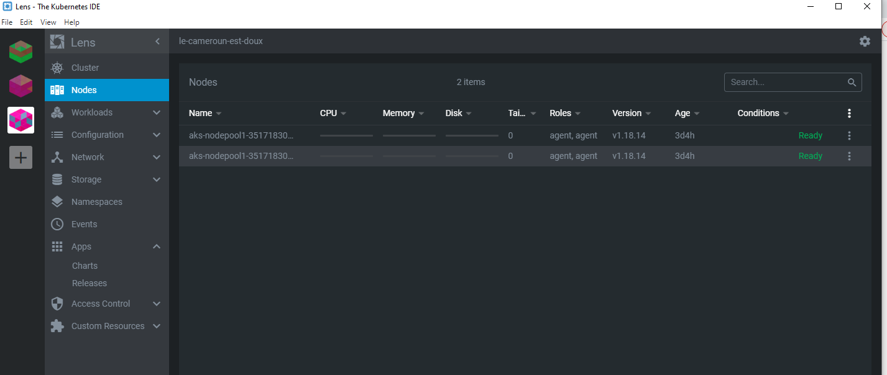
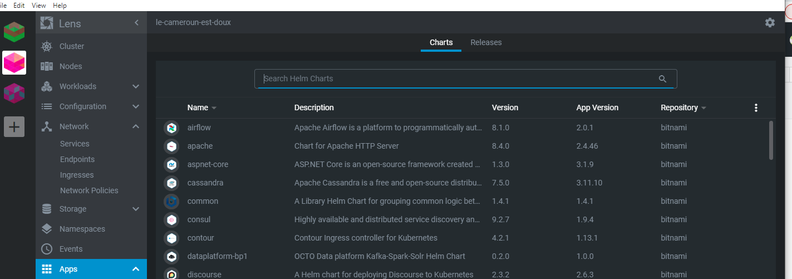
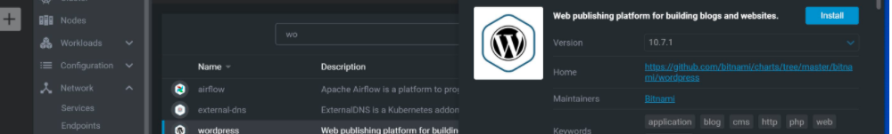
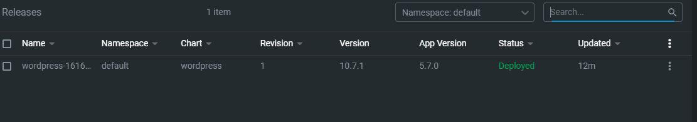
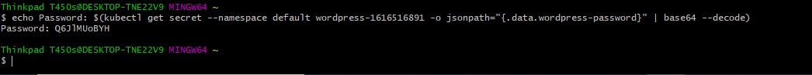
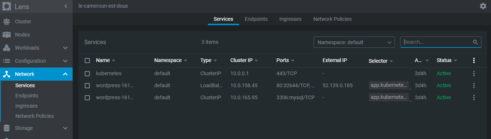
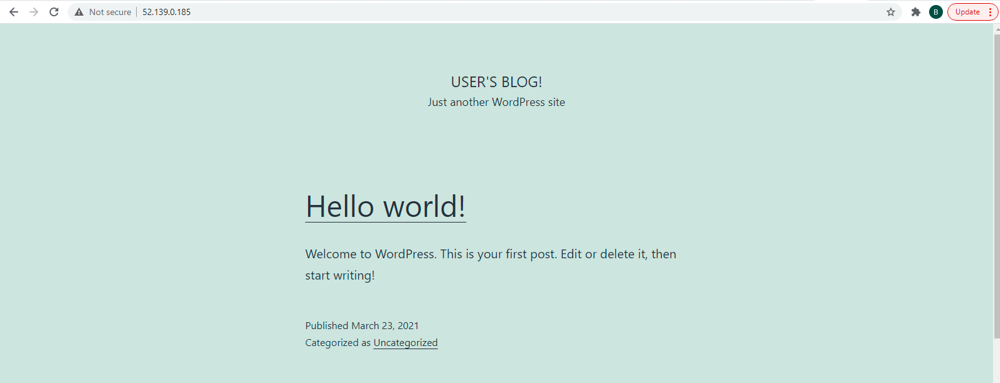
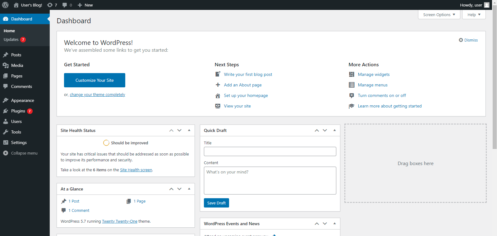

# :rainbow: Installation de WordPress avec Azur Kubernetes

:one: Creation de deux machines virtuelles sur Azure par cluster


-----
:two:Dans Lens selectioner APPS et en suite dans Shart pour choisir l'application a installer 




-----
:three:Verifier que wordpress est installer en cliquant sur APPS puis sur Releases



:four:Recherche du Password 




-------
:five:Recherche de l'adress Ip public en cliquant sur Network et en suite sur Service 



-------
:six: Ouvrir wordPress en ecrivant l'adress public dans le navigateur 



-------
:seven: Aller sur la page d'identification en ecrivant la commmande suivante 

```
Adress IP/admin

```





