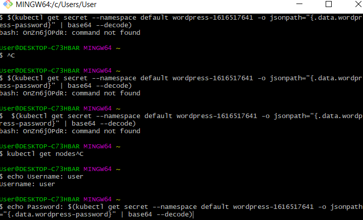
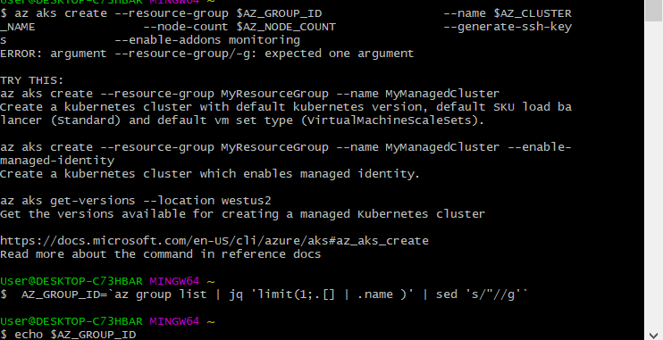
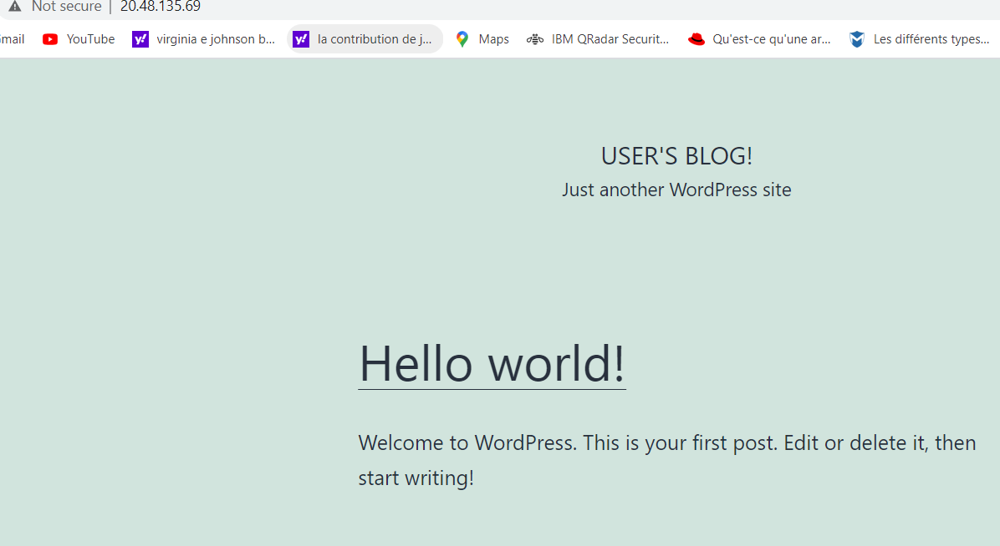
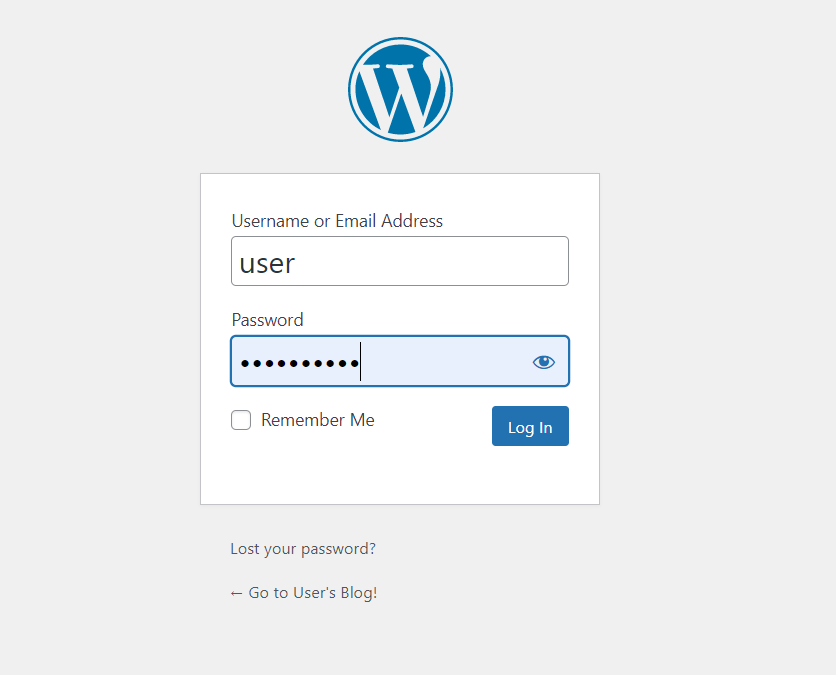
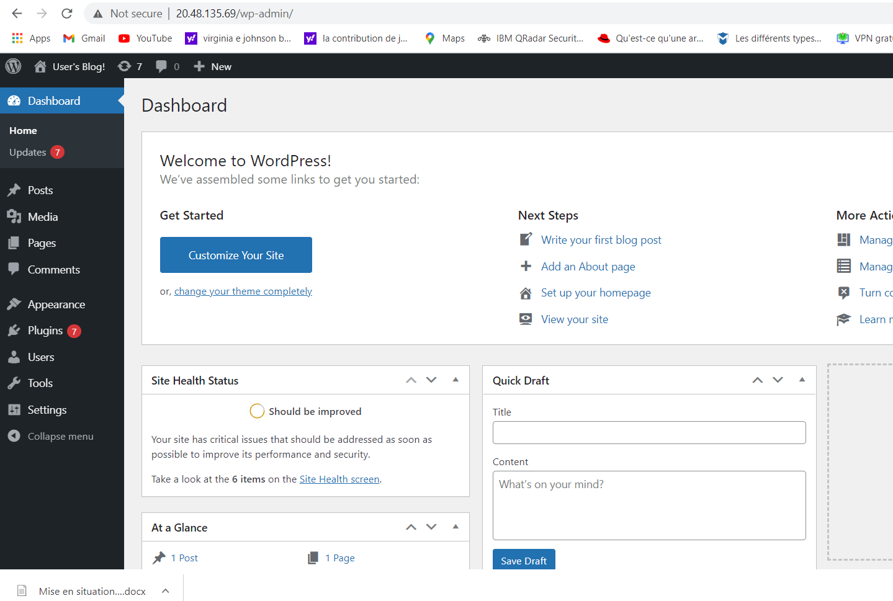

# Installation de Wordpress avec le logiciel Lens

--------------------------------------------

#  creation du mot de passe
------------------------------------

---------------------------
# Creation du kubernetes cluster

------------------------------------

# Cluster Name

------------------------------

----------------------------------------

# Bienvenu sur WordPress

---------------------------------------------

# User Blog: Administrateur

