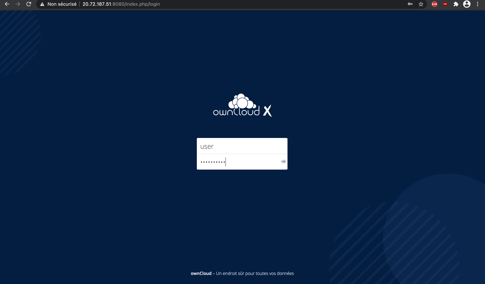
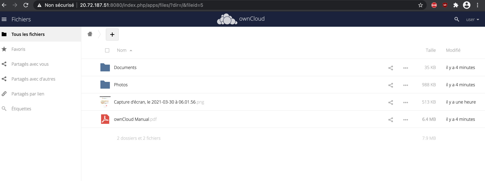
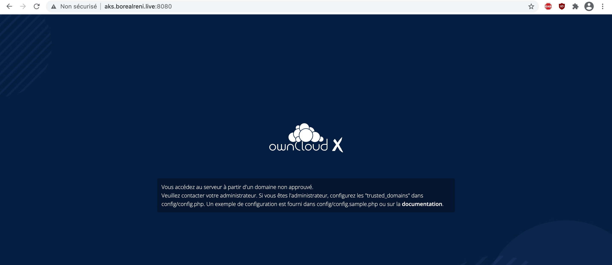
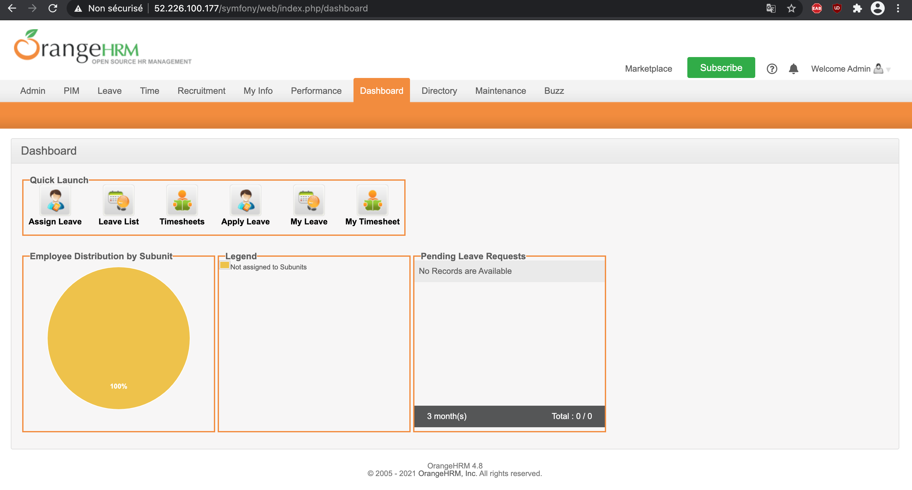
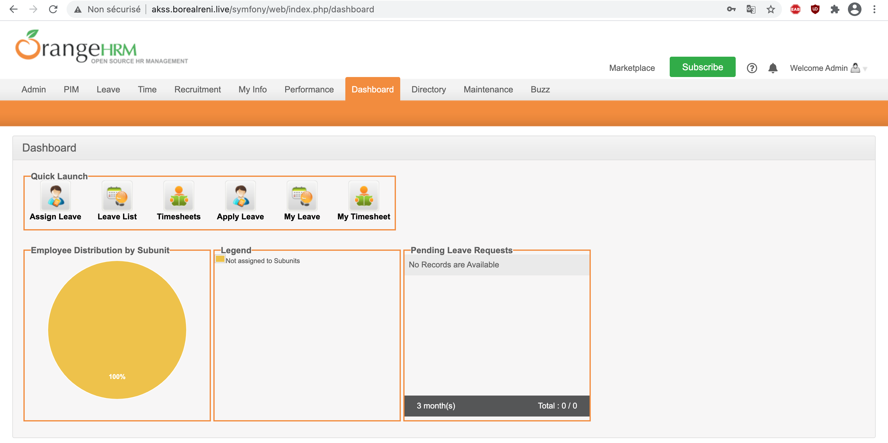

# :one: owncloud: gérer son cloud 


```

```


```

```
## Avec le nom de domaine

```
```


-~~~~~~~~~~~~~~~~~~~~~~~~~~~~~~~~~~~~~~~~~~~~~~~~~~~~~~~~~~~~~~~~~~~~~~-

```
```

# :two: orange HRM: trés utile pour le domaine des ressources humaines


```
```



```

```
## Avec le nom de domaine

